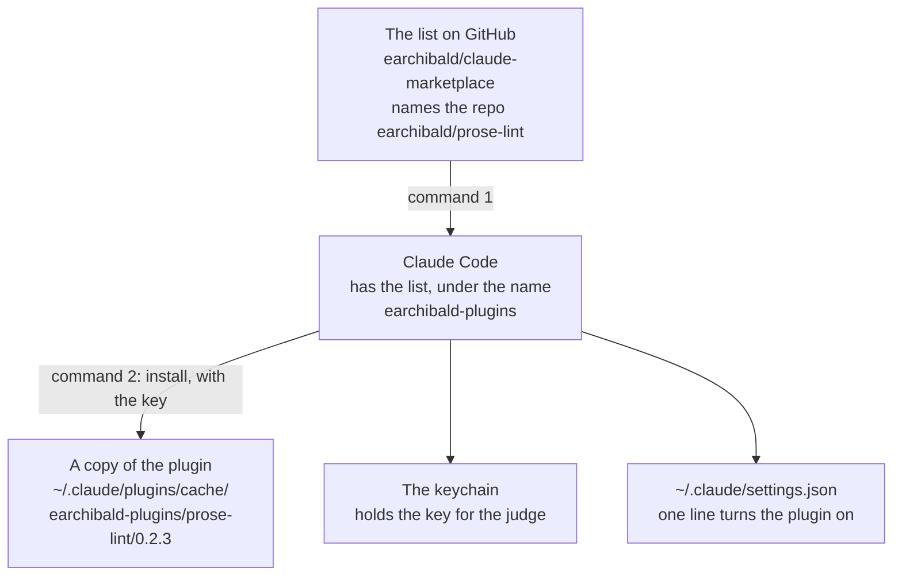
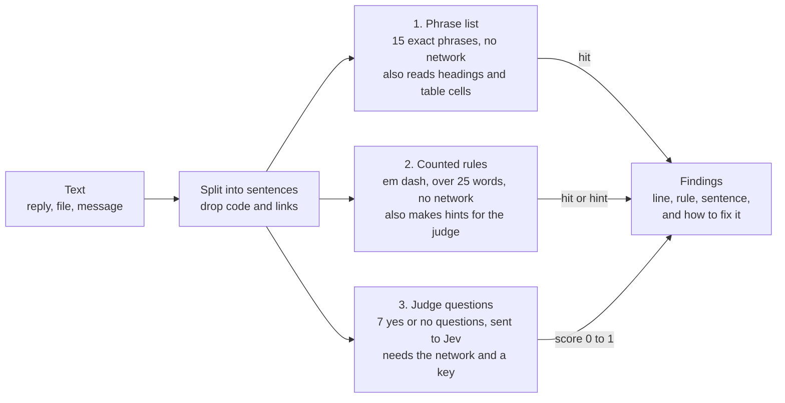
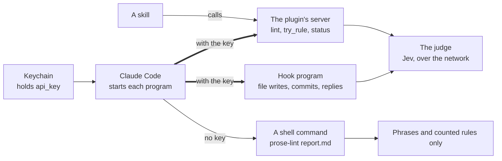

# Prose Lint User Guide

Version 0.2.3. The facts in this guide were checked against the repo on 21 September 2026 (UTC).

## Contents

1. [Introduction](#1-introduction)
2. [Installation](#2-installation): [before you start](#before-you-start), [the two commands](#the-two-commands), [configure](#configure), [turn it off, or update it](#turn-it-off-or-update-it)
3. [Quickstart](#3-quickstart)
4. [Deeper usage](#4-deeper-usage): [what it looks for](#what-it-looks-for), [skills and common jobs](#skills-and-common-jobs), [what Claude sees](#what-claude-sees), [your own rules](#your-own-rules), [the command line](#the-command-line), [where things are kept](#where-things-are-kept), [for maintainers: change the plugin](#for-maintainers-change-the-plugin)
5. [Design docs](#5-design-docs): [how the linter works](#how-the-linter-works), [where it runs](#where-it-runs), [the parts of the plugin](#the-parts-of-the-plugin), [how the key reaches each part](#how-the-key-reaches-each-part), [record of decisions](#record-of-decisions), [what we measured](#what-we-measured), [what we tested](#what-we-tested), [faults the work found](#faults-the-work-found), [limits and open items](#limits-and-open-items)
6. [Glossary](#6-glossary)
7. [References](#7-references)

## 1. Introduction

Prose Lint is a Claude Code plugin. It marks the sentences in Claude's writing that sound like a machine wrote them. It checks the prose files, commit messages, and pull requests that Claude writes, and it records Claude's chat replies. It tells Claude what it found, so that Claude writes the sentence again in plain words. It is for people who use Claude Code and read what Claude writes.

| | |
|---|---|
| **Marked** | The default three-day soak ***carries*** the oracle. |
| **Why** | The sentence gives a test run an act, as if it were a person. The reader must work out what is meant. |
| **Plain** | The oracle runs only in the default three-day soak. |

The plugin has four parts. Before Claude writes, a style file gives it the writing rules. After Claude writes, hooks check the text. When you ask in plain words, skills check a file or change a rule. A small server gives the skills the judge, a small AI model from TypeSafe that scores each sentence. The [glossary](#6-glossary) defines each of these words.

## 2. Installation

### Before you start

| You need | Why |
|---|---|
| Claude Code | The plugin runs inside it. |
| Node 22 or newer, as `node` on your path | The hooks and the server are JavaScript. They use no outside packages. |
| Read access to `github.com/earchibald/prose-lint` | Claude Code clones the plugin from this repo. The repo is private at this time. |
| A key from TypeSafe, the company that runs the judge, if you want the judge | Without a key, the plugin still finds banned phrases, em dashes, and long sentences. |

The first version was a set of hooks that you added to a settings file by hand. That install is retired. Use the plugin.

### The two commands

> [!WARNING]
> **Do not paste the key into a chat with Claude.** Claude Code saves each chat in a transcript. Give the key only in the install command below, or on the configure screen. Both send it straight to the system keychain.

Run these in a terminal. The install output is real, from 20 September 2026.

```
$ claude plugin marketplace add earchibald/claude-marketplace

$ claude plugin install prose-lint@earchibald-plugins --config api_key=YOUR_TYPESAFE_KEY
✔ Successfully installed plugin: prose-lint@earchibald-plugins (scope: user)
5 userConfig options not yet set — run /plugin configure prose-lint@earchibald-plugins
in Claude Code, or pass --config KEY=VALUE.
```

The first command tells Claude Code where the list of plugins is. The second command copies the plugin, puts the key in the keychain, and turns the plugin on. The five options that are "not yet set" all have a default, so you have nothing more to do. Then start a new session, because a session that is already open keeps its old hooks.



Claude Code clones the plugin's repo from GitHub and runs that copy. A change to the plugin reaches a session only after a new version number, a push, and an update.

To check the install, ask Claude "is prose-lint working?" The `setup` skill runs four steps and reports each one. Step 6 of the [quickstart](#3-quickstart) shows them.

### Configure

Run `/plugin configure prose-lint@earchibald-plugins` inside Claude Code. You can also ask Claude, for example "turn off the commit check". The titles in this table are the real ones from the configure screen.

| Option | Title on the screen | Values | Default |
|---|---|---|---|
| `api_key` | TypeSafe key for the judge | text, secret | none |
| `message_format` | Message form | short, long | short |
| `write_feedback` | Check prose files as Claude writes them | on, off | on |
| `commit_check` | Commit messages and pull requests | deny-once, off | deny-once |
| `reply_log` | Record chat replies | on, off | on |
| `session_report` | Report at the start of a session | on, off | on |

The key is kept in the keychain. The other five options are kept in the user settings file, under `pluginConfigs`. A project's settings file cannot set them, so a repo cannot change how the plugin acts.

The write check reads files that end in `.md`, `.mdx`, `.markdown`, `.txt`, or `.rst`. The help text on the configure screen leaves out `.markdown`. The write check does not read source code.

### Turn it off, or update it

| To do this | Run this |
|---|---|
| Turn the whole plugin off | `/plugin disable prose-lint@earchibald-plugins` |
| Turn one part off | Set its option to off on the configure screen |
| Get a new version | `claude plugin marketplace update earchibald-plugins`, then `claude plugin update prose-lint@earchibald-plugins`, then start a new session |

## 3. Quickstart

These steps give you a first finding in a few minutes.

> [!WARNING]
> **Do the test in a folder whose path does not hold `/prose-lint/`.** The write check skips any such path, so that the plugin does not mark its own examples. A test inside the plugin's repo gives no message.

1. **Install the plugin** with the [two commands](#the-two-commands).
2. **Start a new session** in any project, for example with `claude` in a scratch folder.
3. **Ask Claude to write a file** that holds a banned phrase:

   ```
   Write t.md with one line: This check is load-bearing.
   ```

4. **Look for the message.** It arrives right after the write, and Claude rewrites the sentence. This is the real output, 84 characters:

   ```
   prose-lint t.md: 1 to fix
   L1 PH "load-bearing"
   PH banned phrase: use the plain word.
   ```

5. **Check a file on request.** Type `/prose-lint:check t.md`, or ask "check t.md before I send it". Claude runs all the layers, the judge included, and shows a table of findings. It rewrites only if you ask. Without a key, this step shows only banned phrases, em dashes, and long sentences.
6. **Ask "is prose-lint working?"** The `setup` skill runs these four steps. This is the same test as at the end of the installation.

   ```
   1. status        key: set, from the plugin option   version: 0.2.3
   2. lint          "This check is load-bearing. A guard that cannot fail protects nothing."
                    PH and SA 0.93, judge: ran
   3. write a file  a prose-lint message arrives right after the write
   4. status again  the time of the last line in the write log is new
   ```

If step 4 gives no message, check three things. The session must have started after the install. The file must end in a prose extension. The path must not be on the ignore list. See [your own rules](#your-own-rules).

## 4. Deeper usage

### What it looks for

The patterns came from three sources. They are Eugene, a public list of overused AI phrases, and sentences in our own reports. Each row shows a real sentence and its plain form. The code is the two letters that a message uses for the pattern.

| Code | Pattern | Do not write | Write | Found by |
|---|---|---|---|---|
| TP | A thing written as a person | The suite owes one run that arrives by simulating. | Add one run that reaches the date by simulation. | Judge |
| DF | A saying in the form of a definition | A skip is output nobody reads. | Two tests printed a skip reason on every run. No reviewer read it. | Judge |
| SA | A quotable general truth | A guard that cannot fail protects nothing. | This guard passes for every input. Give it a case that fails. | Judge |
| HO | A claim of honesty | Here is my honest summary. | Give the summary. | Judge |
| AN | An announcement of what comes next | Let me break down what is happening. | Start with the content. | Judge |
| RV | A staged reveal | The catch: nobody ever ran it. | No runner names this file, so it never ran. | Judge |
| CO | An opening compliment | Great question! | Start with the first fact. | Judge |
| PH | A banned phrase | This check is load-bearing. | Task 3 misses its budget without this check. | Phrase list, 15 phrases |
| ED | An em dash | The run passed — nobody saw it. | The run passed. Nobody saw it. | Counted rule |
| LS | A sentence over the word limit | Any sentence over 25 words. | Two sentences. | Counted rule |
| TR | Three items for rhythm | The result is faster, cleaner, and simpler. | The run takes 4 s, down from 15 s. | Hint only |

The plugin never puts a hint in a message to Claude. Only the judge can confirm a hint. The judge scored the "three items" pattern poorly, so TR stays a hint. The style file also names two patterns that no rule checks: a denied claim that nobody made, and a figure of speech for effect.

> [!NOTE]
> In fiction, a fire or a river can act. The TP rule is for reports and chat. To keep the checks away from fiction, add its folder to the ignore list in [your own rules](#your-own-rules).

### Skills and common jobs

You do not need to remember a skill's name. Say what you want, and Claude picks the skill from its description. Each skill is also a command that you can type, such as `/prose-lint:rules`.

| You say | Skill | What Claude does |
|---|---|---|
| "Ban the phrase 'moving forward'." | `rules` | Drafts a phrase rule, tests it with `try_rule`, shows the result, and saves it in your rules file |
| "Stop it when I stack hedges like 'may perhaps'." | `rules` | Writes a yes or no question for the judge and tests it on ten sentences. Then it sets the pass mark between the two groups of scores. |
| "That one is a false alarm." | `rules` | Finds which rule fired and why. Then it picks the smallest fix: nothing, an ignored path, a better question, or a higher pass mark. |
| "Make the saying rule stricter." "Allow 30 words." | `rules` | Changes one number in your rules file, and shows two real sentences on each side of the new mark |
| "Don't check anything under /drafts/." | `rules` | Adds the path to the ignore list |
| "Check this report before I send it." | `check` | Calls `lint` with the judge, and shows a table of findings. It rewrites only if you ask. |
| "How is my writing this week?" | `report` | Summarises the three logs, with counts, rates, and the marked sentences quoted exactly |
| "Is prose-lint working?" "Turn off the commit check." "Use long messages." | `setup` | Runs `status` and the four setup steps, or changes one option. For the key, Claude gives you the command, because it cannot write to the keychain. |
| A prose-lint message arrives with codes | `plain-prose` | Claude reads how to fix each code, with a marked and a plain example for each |

#### An example: ban a phrase

This conversation is a mock-up. The test result in it is real.

> **You:** Ban "moving forward". I keep seeing it at the start of sentences.
>
> **Claude** *(rules skill: status, then try_rule)*: I tested two drafts. The first one is too broad.
>
> | Draft | "Moving forward, we test." | "The wolf is moving forward slowly." | Result |
> |---|---|---|---|
> | `moving forward` | matched | matched | too broad |
> | `moving forward,` | matched | no match | ok |
>
> The second draft needs the comma, so it marks the filler use and leaves the wolf alone. Save it?
>
> **You:** Yes.
>
> **Claude** *(edits ~/.claude/prose-lint/rules.local.json, then status and lint)*: Saved. Your rules file has no errors. A last check on "Moving forward, we ship." gave the code PH. The rule is live now, in every session, with no restart.

The first live run of `try_rule` used these two sentences. It showed that the matcher could not match a phrase that ends in a comma. Version 0.2.1 fixed that fault.

### What Claude sees

After a file write. Real output, 84 characters:

```
prose-lint t.md: 1 to fix
L1 PH "load-bearing"
PH banned phrase: use the plain word.
```

When a commit is stopped, the message has this form. The two findings are examples.

```
prose-lint: the commit message has 2 to fix,
so the command did not run. Send the same text
again only for a quotation.
L3 SA "A message nobody checks is a message…"
L3 TP "The hook carries the judge to every…"
SA saying: state the fact in this case.
TP thing as person: say what it is or has.
```

At the start of a session. Real output from the code, not yet seen in a live session:

```
prose-lint, your last 40 replies in this project:
LS 55, TP 32, ED 30, AN 15 (for each 100
sentences: 9, 5, 5, 2).
LS over the word limit: make two sentences.
TP thing as person: say what it is or has.
ED em dash: use a full stop or a comma.
AN announcement: start with the content.
Most marked: "Three things about the page that
you should know:" (AN)
```

This report is 352 characters. We ran the hook program outside a session, on the real reply log of one project. The report appears only when the log holds five or more replies from the same project in the last seven days.

Each message names the file once and explains only the codes that it used. A helper agent does not get the style file, so a bare code would mean nothing to it.

The commit check stops a message only once. If Claude sends the same text again, the hook passes it and writes "kept" in the log. A commit message sometimes must quote a faulty sentence, and this rule allows that. The check reads a commit message and the text of a pull request, an issue, or a comment made with `gh`. It leaves out the attribution lines.

### Your own rules

Claude Code runs a copy of the plugin, and an update replaces that copy. So the plugin reads two rules files and joins them on every run.

| File | Who changes it | An update |
|---|---|---|
| `rules.json` in the plugin folder | Whoever maintains the plugin | Replaces it |
| `~/.claude/prose-lint/rules.local.json` | You, or Claude through the `rules` skill | Leaves it alone |

In your file you can add a phrase or turn one off. You can add a question, or change one field of a question. You can also change the word limit and add an ignored path. If your file has a mistake, the plugin uses its own rules alone, and `status` names the mistake.

| Part of the rules | What it holds |
|---|---|
| `phrases` | 15 regular expressions. Each has a plain alternative and an example that a test checks. |
| `questions` | 7 yes or no questions for the judge. Each has a code, a `min` (its pass mark), and a `version`. |
| `agentVerbs` | 54 verbs. When a sentence gives one of them to a lifeless subject, the linter makes a TP hint. |
| `limits` | 25 words for a sentence, 18 for a clause |
| `hook` | The prose file types, the ignored paths, the rules that are off for some paths, and at most 12 findings in one message |
| `codes` | The code and the short fix for each rule that is not a question |

When you change the text of a question, raise its `version`. The judge then answers that question again for each sentence, instead of using a saved answer.

### The command line

Inside a Claude Code session, the plugin puts `prose-lint` and `prose-lint-log` on the shell path.

```
prose-lint report.md notes.md      # all the layers
prose-lint --no-jev report.md      # no network: phrases, counted rules, hints
prose-lint --min 0.8 report.md     # one pass mark for every question
git diff | prose-lint --json       # text in, JSON out
prose-lint-log --since 2026-09-20  # what the reply log has recorded
```

| Exit code | Meaning |
|---|---|
| 0 | No findings |
| 1 | One or more findings |
| 2 | The tool could not run |

> [!WARNING]
> **A shell command does not get the key from the keychain.** It looks for `TYPESAFE_API_KEY` in the environment, then in `~/.config/prose-lint/env`, then in `.env` in the current folder. With no key, the judge does not run, and the last line of output says so. To use the judge from a skill, call the server's `lint` tool, which has the key.

### Where things are kept

| Thing | Place |
|---|---|
| The copy of the plugin that Claude Code runs | `~/.claude/plugins/cache/earchibald-plugins/prose-lint/0.2.3` |
| The style file | `output-styles/plain-prose.md` in the plugin. It is on whenever the plugin is on. |
| The key | The system keychain. The old key file, `~/.config/prose-lint/env`, is a fallback for the shell command only. |
| The options | `~/.claude/settings.json`, under `pluginConfigs` |
| Your own rules | `~/.claude/prose-lint/rules.local.json` |
| The three logs: replies, file writes, commits | `~/.claude/prose-lint/chat.jsonl`, `writes.jsonl`, `commits.jsonl` |
| The list of kept commits | `~/.claude/prose-lint/acks.json` |
| Saved judge answers | `~/.cache/prose-lint/jev.json` |
| The source | `github.com/earchibald/prose-lint`. The working clone is `~/Code/prose-lint`. |

To move the folder of logs and rules, set `PROSE_LINT_HOME`. The shell command, the hooks, and the server must all get the same value.

### For maintainers: change the plugin

```
# 1. edit the code in ~/Code/prose-lint, and run the tests
npm test
# 2. raise "version" in .claude-plugin/plugin.json, commit, and push
git push
# 3. tell Claude Code
claude plugin marketplace update earchibald-plugins
claude plugin update prose-lint@earchibald-plugins
✔ Plugin "prose-lint" updated from 0.2.2 to 0.2.3 for scope user. Restart to apply changes.
```

Without a new version number, Claude Code sees no change and keeps the old copy. To try a change with no install, run `claude --plugin-dir ~/Code/prose-lint`.

## 5. Design docs

Each number in this part has its date and conditions beside it.

### How the linter works

The linter splits text into sentences and leaves out code, links, and tables. Then each sentence goes through three layers. Two layers are plain code and need no network. For the third layer, the linter sends questions to the judge.



The first two layers always run. The judge layer runs when the network and the key are there. When it cannot run, the output says so, and the hints stay in the list.

- **A judge answer replaces a hint.** The linter marks the word "carries" as a hint. If the judge scores the sentence under 0.70, the linter drops the hint. "Esk carries the wood to the fire" scores 0.05.
- **The judge also reads each clause of a long sentence.** A pattern inside a long sentence gets a lower score. So the linter also sends each clause of 18 words or fewer, and it keeps the highest score.
- **The rules are in one data file.** The phrases, the questions, and each pass mark are in `rules.json`. To ban a new pattern, add a row. The code does not change.
- **The judge never answers the same question twice.** The linter saves each answer in `~/.cache/prose-lint/jev.json`, and a second run over the same text sends nothing.

### Where it runs

One linter reads all the text. Four moments in a session call it.

```mermaid
flowchart LR
  s(["Session starts"]) --> style["Style file and report<br/>rules and code table go into<br/>Claude's instructions, with<br/>4 lines on recent replies"]
  w(["Claude writes a file"]) --> wc["Write check<br/>reads the new text of a<br/>prose file, in about 1 s"]
  g(["Claude runs git or gh"]) --> cc["Commit check<br/>reads the commit message, or<br/>the text of a PR or an issue"]
  r(["Claude's reply ends"]) --> rl["Reply log<br/>writes one line to a log<br/>and says nothing"]
  wc -. "findings go back to Claude" .-> claude["Claude"]
  cc -. "the command did not run" .-> claude
  rl -. "feeds the next report" .-> style
```

The dotted lines are messages. The reply log sends no message to Claude, because the reply is already on screen when the hook runs.

Claude Code can filter a hook by command, with a rule such as `Bash(git commit *)`. Our commits often start with `cd folder &&`, and that rule would miss them. So the hook program starts on every shell command. It stops at once when the command text has no `git` or `gh`.

### The parts of the plugin

```mermaid
flowchart TB
  claude["Claude, in a session<br/>writes replies, files, and commit messages"]
  subgraph plugin["The plugin"]
    style["Style file<br/>writing rules and code table,<br/>forced on while the plugin is on"]
    hooks["Hooks: one program, four moments<br/>session start: a 4-line report<br/>file written: the findings<br/>git or gh: stop once<br/>reply ends: one log line"]
    skills["Five skills<br/>check, rules, report,<br/>setup, plain-prose"]
    server["Server<br/>lint, try_rule, status,<br/>log_summary"]
    linter["One linter<br/>split, phrases, counted rules,<br/>judge questions, findings"]
  end
  subgraph outside["Outside the plugin: an update does not touch these"]
    kc["Keychain<br/>the key"]
    settings["~/.claude/settings.json<br/>the five other options"]
    home["~/.claude/prose-lint/<br/>your rules, three logs,<br/>the list of kept commits"]
    judge["The judge<br/>Jev, over the network"]
  end
  style -. "rules, once" .-> claude
  claude -- "each moment" --> hooks
  hooks -. "short message" .-> claude
  claude -- "reads when a job fits" --> skills
  skills -- calls --> server
  hooks --> linter
  server --> linter
  home -- "your rules, on every run" --> linter
  linter -- asks --> judge
```

The hooks and the server use the same linter. So a check from a skill gives the same result as a check from a hook. Everything that a user owns is outside the folder that an update replaces.

```
prose-lint/
├─ .claude-plugin/
│  ├─ plugin.json          the name, the version, and the six options
│  └─ marketplace.json     a list file that names this one plugin
├─ .mcp.json               tells Claude Code to start the server, with the key
├─ hooks/
│  ├─ hooks.json           four moments, all sent to one program
│  ├─ dispatch.js          that program
│  └─ stop-log.js, write-feedback.js, commit-check.js   the retired hooks, still tested
├─ server/mcp.js           the server: lint, try_rule, status, log_summary
├─ skills/                 check, rules (+ rules-file.md), report, setup, plain-prose
├─ output-styles/plain-prose.md   the writing rules and the code table
├─ rules.json              the rules that ship with the plugin
├─ lib/                    the linter: split, phrases, counted rules, judge, messages
│  └─ events/              one file for each moment: session, write, commit, reply
├─ bin/                    prose-lint and prose-lint-log, the shell commands
├─ tests/                  96 tests, no network
└─ docs/guide.md           this guide
```

| Measure, on 21 September 2026 | Value |
|---|---|
| JavaScript in `lib/`, the dispatch program, the server, and `bin/` | 570 lines |
| Tests | 96 tests in 776 lines. All pass in 0.5 seconds. |
| The rules file | 291 lines |
| The five skills, the rules reference, and the style file | about 4,260 words |
| Outside packages | none |

### How the key reaches each part

A plugin option marked `sensitive` goes to the system keychain, and it never appears in a settings file. Claude Code gives that value to only two kinds of program: the plugin's hooks and the plugin's server. A shell command that Claude runs gets nothing, as [what we tested](#what-we-tested) shows.

So a skill that ran `prose-lint report.md` in the shell would have no key, and the judge would not run. That is why the plugin has a small server. A skill calls the server's `lint` tool, and the server has the key.

The two kinds of program get the key in two ways. A hook finds it in the variable `CLAUDE_PLUGIN_OPTION_API_KEY`. The server gets it only when `.mcp.json` asks for `${user_config.api_key}`. Claude Code fills in that form, and it leaves other forms as plain text.



The shell command still finds phrases, em dashes, and long sentences. If the old key file is on the machine, the shell command reads it as a fallback.

### Record of decisions

An earlier handbook ended with a proposal for a lighter design. Versions 0.2.0 to 0.2.3 built most of it. This table records each idea, what exists now, and what is still open.

| Idea | What was proposed | What exists now | State |
|---|---|---|---|
| Package it as a plugin | One folder with hooks, a style file, and commands. The plugin names its own folder, so a moved folder breaks nothing. | Plugin 0.2.3, installed from GitHub with two commands. The commands became five skills, and we added a server for the key. | built |
| One program for all hooks | One dispatch program in place of three hook programs | `hooks/dispatch.js` serves four moments. Each option turns one moment off. | built |
| Short codes | Teach a legend once in the style file. Then a message for 3 findings drops from 911 characters to about 149. | The short form is the default. A message for one finding is 84 characters, down from 503. Each message explains its own codes, because a helper agent does not get the style file. The long form is still an option. | built |
| Compare the fix rate of short and long messages | Send codes in half of the sessions for a week, and compare how often the next edit fixes the sentence | Not run. The write log has the data. | open |
| A report at the start of a session | Four lines from the reply log, with Claude's own sentences as examples, about 60 tokens | Built. It needs five replies from the same project in the last seven days. Tests cover it. Nobody has yet seen it in a live session. | built |
| Judge only the suspicious sentences | Send the judge only a sentence with a listed verb, a colon, or fewer than seven words | Measured over 1,204 sentences. It cut the requests by half and lost 64 of 176 findings, 50 of them TP. The hooks spent 8 cents in their first evening, so the saving is too small. | rejected |
| An editor helper | A helper agent lints a long document, rewrites it, and returns only the clean text | Not built. A rewrite by a helper can change a fact, and the review panel found this once already. | open |
| A rewrite request from the reply log | Ask for a rewrite when a reply has three or more strong findings | Not built. The reader would see a first reply and then a second. Eugene chose "log only". | declined |
| Fix banned phrases by program | Replace a phrase in the file with no message | Not built. "Load-bearing" has no single replacement. The right word is different in each sentence. | rejected |
| Set pass marks from panel verdicts | Use the human panel's verdicts to set each `min` | Not done. It needs a few weeks of panel results and log data. | open |

The hand install had four entries in a settings file, which started three programs. Full paths in the settings file broke the hooks when the folder moved. The plugin has one program for four moments, and two install commands. The number of moments stays about the same, because Claude Code needs one entry for each moment. The setup, the size of each message, and the work on ordinary shell commands all went down.

#### Two corrections made during the build

- **Claude Code merged commands into skills.** The Claude Code documentation says that custom commands "have been merged into skills". A file in a `commands/` folder still works, and the documentation calls that form "legacy". A skill can also have extra files and a list of the tools that it may use. Claude can start a skill by itself when a request fits its description.
- **The key does not reach the shell.** The brief assumed that a skill could run the shell command with the key. It cannot, so the plugin added the server. [How the key reaches each part](#how-the-key-reaches-each-part) explains this.

### What we measured

All of these numbers were measured on 20 and 21 September 2026 (UTC), with the judge model Jev 1.13. They were not measured again for this guide.

#### Can the judge tell a faulty sentence from a plain one?

We wrote one faulty sentence for each pattern, and several plain sentences. A score near 1 means "yes, this is the pattern".

| Sentence | Kind | Score |
|---|---|---|
| "Here is my honest summary" | faulty | 0.99 |
| "Let me break down…" | faulty | 0.97 |
| "The catch: nobody ran it" | faulty | 0.97 |
| "A guard that cannot fail…" | faulty | 0.93 |
| "A number travels with…" | faulty | 0.89 |
| "A sweep … is a sweep that…" | faulty | 0.84 |
| "The soak has six seeds" | plain | 0.16 |
| "Esk carries the wood" | plain | 0.05 |
| "The wolf hides in the pines" | plain | 0.02 |

Two patterns did poorly. "Not X, it is Y" scored 0.68 on its planted sentence. A list of three for rhythm scored 0.36, so plain code looks for that pattern and reports it only as a hint.

#### Does the judge agree with human reviewers?

Three reviewers had already judged 39 lines of text from a game. They named 9 pairs of lines as repeats of each other. We gave the judge all 283 possible pairs. It ranked all 9 named pairs in its top 35. "The dry room" scored 0.88 for a modern word, and the next line scored 0.52.

#### How common are the patterns in our own writing?

| Text | Size | Result |
|---|---|---|
| The last 40 commit messages in one project, merges left out | 40 messages | 34 had a finding: 64 TP, 8 RV, 7 SA, 115 LS |
| Chat replies from the reply log, 6 sessions | 43 replies, 588 sentences | 33 replies had a finding. For each 100 sentences: 10 LS, 5 ED, 5 TP |
| The memory index that every session of that project loads | 69 lines | 16 findings before a rewrite, 6 after. Most titles were sayings, such as "A skip is output nobody reads". |
| The text of a game | 5,721 strings and 215 story lines | No banned phrase. 2 em dashes in one menu. |

#### Cost and speed

| Measure | Value |
|---|---|
| Price of the judge | $42 for one billion tokens read. The judge charges nothing for its answers. |
| Total spent in two days, all tests and all hooks | Under 50 cents |
| One sentence, seven questions | About 1,100 tokens. The seven questions are about 1,075 of them, and the sentence is about 25. |
| A file write of four sentences | 0.8 seconds |
| A report of 133 sentences | 3.0 seconds the first time, 0.04 seconds from saved answers |
| Saved answers, on 21 September 2026 | 35,329 answers in a 1.1 MB file |
| The commit hook on each shell command, hand install | About 40 milliseconds |

### What we tested

These checks were run on 20 and 21 September 2026 (UTC), during the build of versions 0.2.0 to 0.2.3.

| Claim | How we checked | Result |
|---|---|---|
| The code works | Tests, each written first and seen to fail. None uses the network. | 96 pass |
| The off switches work | We broke the options on purpose | The two tests for them failed, as they should |
| Claude Code accepts the plugin | `claude plugin validate` on both manifest files | Both pass |
| A hook sends the short message | A small model in a real session wrote a file with a banned phrase | It quoted the 84-character message word for word |
| The skills and the style file load | The same session listed its skills and its instructions | Five skills, and the style with the code table |
| A shell command gets no plugin values | `env \| grep -c CLAUDE_PLUGIN` inside that session | 0 |
| The key is not in a settings file | We read the settings file after the install | Only the line that turns the plugin on |
| The server gets the key from the keychain | With the old key file set aside, a session called `lint` on a sentence that no saved answer covered | The judge ran and read 1,135 new tokens. `status` said "set, from the plugin option". |
| A hook gets the key from the keychain | With the old key file set aside, a session wrote a sentence that no saved answer covered | The judge ran and read 1,135 new tokens |
| Each write is checked once | One file write in a session after the hand-made hooks were removed | One log line. Before, there were two. |
| An update reaches the copy | We raised the version, pushed, and ran the update | The 0.2.3 copy has the new server config |
| The install comes from GitHub | We read Claude Code's record of the install | The copy is in `cache/earchibald-plugins`, at the commit that was pushed |

### Faults the work found

- **The commit hook stopped a good message** for "a sentence of 46 words". It was two sentences. The splitter did not allow a sentence to start with a lowercase file name.
- **The linter cut its own output at 65,536 bytes** when another program read it through a pipe.
- **The linter skipped "Good." and "Great question!"** because both are under three words. Those are the compliments that it must catch.
- **A phrase that ends in a comma never matched.** The first live run of `try_rule` found this. Version 0.2.1 fixed it.
- **An early handbook said that the server had the key, and it did not.** The config file named the key in a form that Claude Code does not fill in. So the server read the old key file, and `status` named the wrong source. We found the fault when we set the key file aside. The hook still reached the judge, and the server said "not set". Version 0.2.3 asks in the form that works, and two tests hold the fix.

### Limits and open items

The state of each item was checked on 21 September 2026 (UTC).

| Item | State |
|---|---|
| **No pass mark is proven.** Each `min` is a first guess. TP scores between 0.70 and 0.79 are often wrong: "Five suites landed on dev" scored 0.77. | Open. Use the `report` skill and the three logs to set the marks. |
| **Two parts have not been seen live under the plugin:** the session report and the reply log. Tests cover both. | Open. The plugin went in at about 05:18 UTC on 21 September. The last line in each log is older than that. |
| **The reply log cannot stop a reply.** The reply is on screen before the hook runs. | By design. The style file does the work for chat. |
| **The style file does not reach a helper agent.** A helper agent has its own instructions. | By design. The write check and the commit check do reach a helper agent, and we tested that. Each message explains its own codes. |
| **Text that a shell command writes is not checked.** If Claude writes a file with `cat` or `sed`, the write check does not run. | Open |
| **Claude can learn to avoid the questions.** A new habit that no question names will pass. | Open. The human review panel stays the final judge. Add a rule when someone sees a new habit. |
| **Every shell command starts a small program.** | By design. The program stops at once for a command with no `git` or `gh`. |
| **A small model could not call the server's tools.** Haiku found the tools and then said that it could not use them. Sonnet called all three with no trouble. | Open. The hooks do not use the server. |
| **The server was reported as not connected** at the start of one session on 21 September. Later in the same session, `status` answered. By hand, the server starts and lists its tools. | Open. Cause not known. |
| **The copy in the cache holds the whole repo**, with the tests and `docs/`. The cache copy of 0.2.3 is 348 KB. | Accepted. A size under 5 MB is of no concern. |
| **The plugin's repo on GitHub is private.** The marketplace list is public. Only an account with access to the repo can install the plugin. | Open. To make it public: `gh repo edit earchibald/prose-lint --visibility public --accept-visibility-change-consequences` |
| **The working folder was in Workshop.** | The primary clone is now `~/Code/prose-lint`. The old folder, `~/Workshop/001-prose-lint`, is still on disk. |

## 6. Glossary

This guide uses each of these words with one meaning only.

| Word | Meaning |
|---|---|
| Code | Two letters that name one pattern in a message, such as PH for a banned phrase. The table in [what it looks for](#what-it-looks-for) lists all eleven. |
| Finding | One marked sentence, with the line, the rule that marked it, and how to fix it. |
| Hint | A shape that code can see but cannot confirm. "Carries" is a hint, because a person can carry wood. Only the judge can turn a hint into a finding. |
| Hook | A small program that Claude Code runs by itself at a fixed moment, such as after Claude writes a file. |
| Judge | Jev, a small AI model from the company TypeSafe. It answers a yes or no question about one sentence with a score from 0 to 1. |
| Marketplace | A list of plugins that Claude Code can install from. This plugin is in `earchibald/claude-marketplace`, which Claude Code calls `earchibald-plugins`. |
| Moment | A point in a session at which Claude Code runs a hook. The plugin uses four: the session starts, Claude writes a file, Claude runs a shell command, and a reply ends. |
| Option | One setting of the plugin, such as `commit_check`. You change it on the configure screen. |
| Pass mark | The score at which a judge question reports a finding. In the rules file it is the field `min`. |
| Plugin | A folder that Claude Code installs with one command. It can hold hooks, skills, a style file, and a server. |
| Rules file | The data that says what the linter looks for. The plugin has `rules.json`, and your own additions go in `rules.local.json`. |
| Server | A small program that stays open during a session and gives Claude a few tools to call. Claude Code calls this kind of server an MCP server. |
| Session | One conversation with Claude Code. |
| Skill | A page of instructions that Claude reads when a job calls for it. You can also start one yourself, for example `/prose-lint:check`. |
| Style file | A page of writing rules that Claude Code adds to Claude's instructions at the start of every session. |

## 7. References

| Source | What it is |
|---|---|
| [github.com/earchibald/prose-lint](https://github.com/earchibald/prose-lint) | The plugin's repo. It is private at this time. |
| [github.com/earchibald/claude-marketplace](https://github.com/earchibald/claude-marketplace) | The marketplace list that names the plugin |
| [docs.typesafe.ai](https://docs.typesafe.ai) | The TypeSafe documentation, with the Jev model and its scores |
| [github.com/bnaylor/llm-cliche-hall-of-shame](https://github.com/bnaylor/llm-cliche-hall-of-shame) | A public list of overused AI phrases, under the MIT licence. Some banned phrases came from it. |
| [Claude Code: plugins](https://code.claude.com/docs/en/plugins), [plugins reference](https://code.claude.com/docs/en/plugins-reference), [marketplaces](https://code.claude.com/docs/en/plugin-marketplaces) | How a plugin is built, installed, and configured |
| [Claude Code: hooks](https://code.claude.com/docs/en/hooks) | The hook moments and what a hook can send back |
| [Claude Code: skills](https://code.claude.com/docs/en/skills) | Skills, and the note that commands were merged into them |
| [Claude Code: output styles](https://code.claude.com/docs/en/output-styles) | How a style file changes Claude's instructions |
| [ASD-STE100](https://www.asd-ste100.org/) | Simplified Technical English. The writing rules of this guide and of the style file come from it. |
